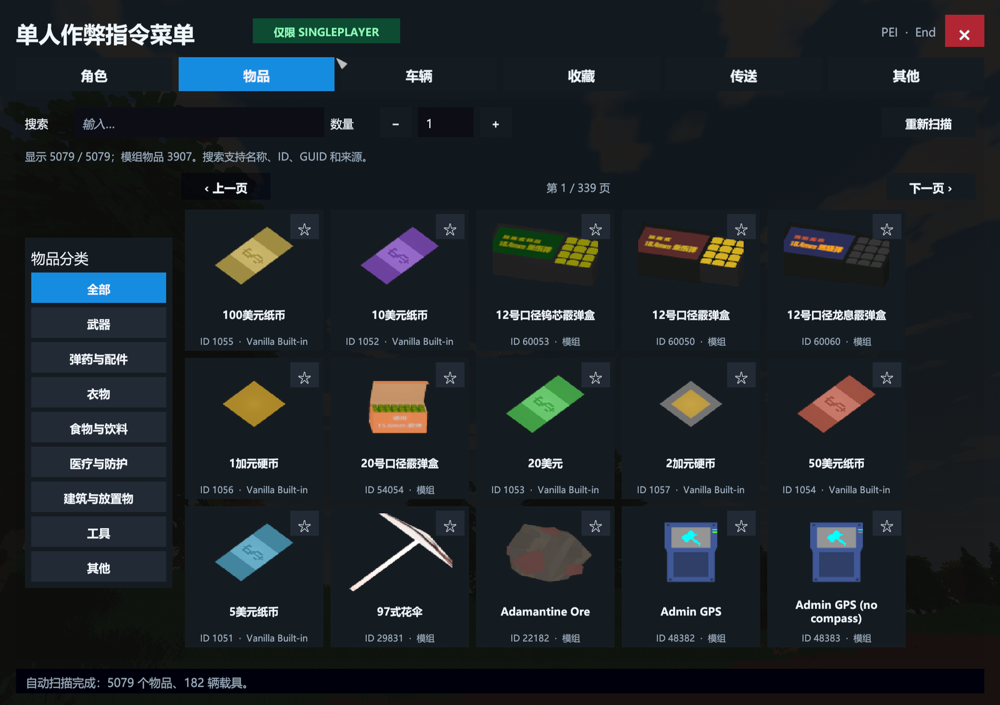
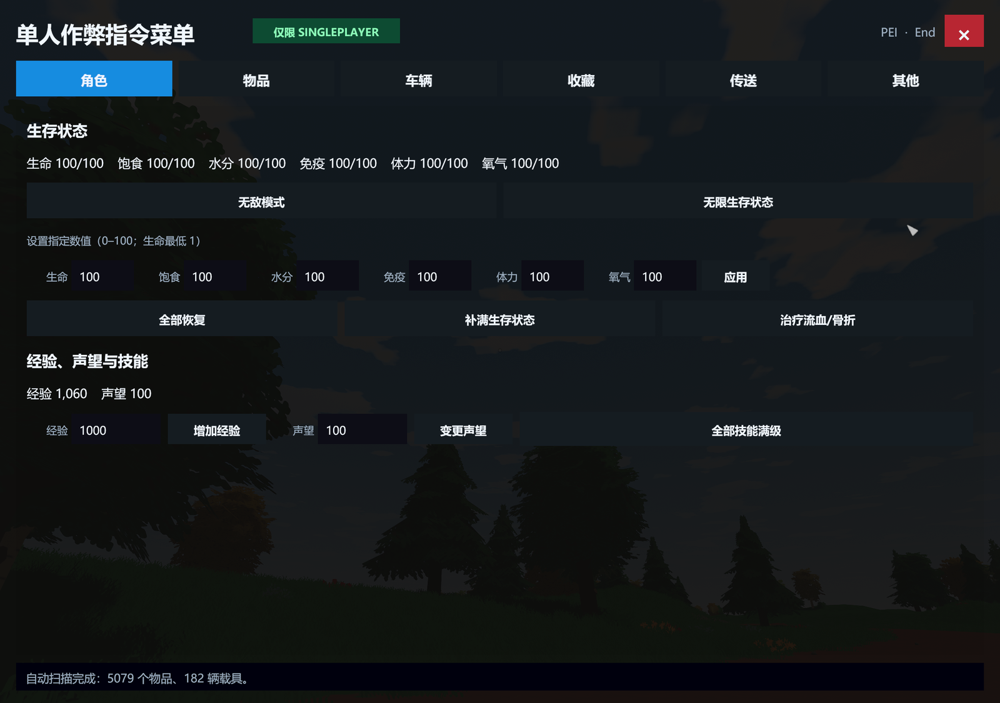
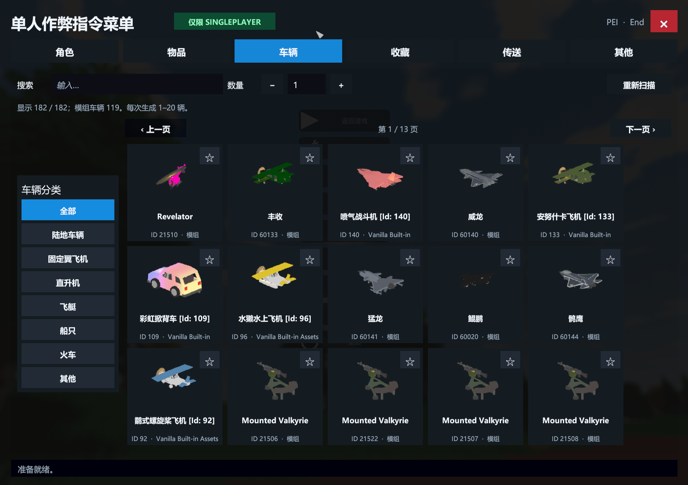
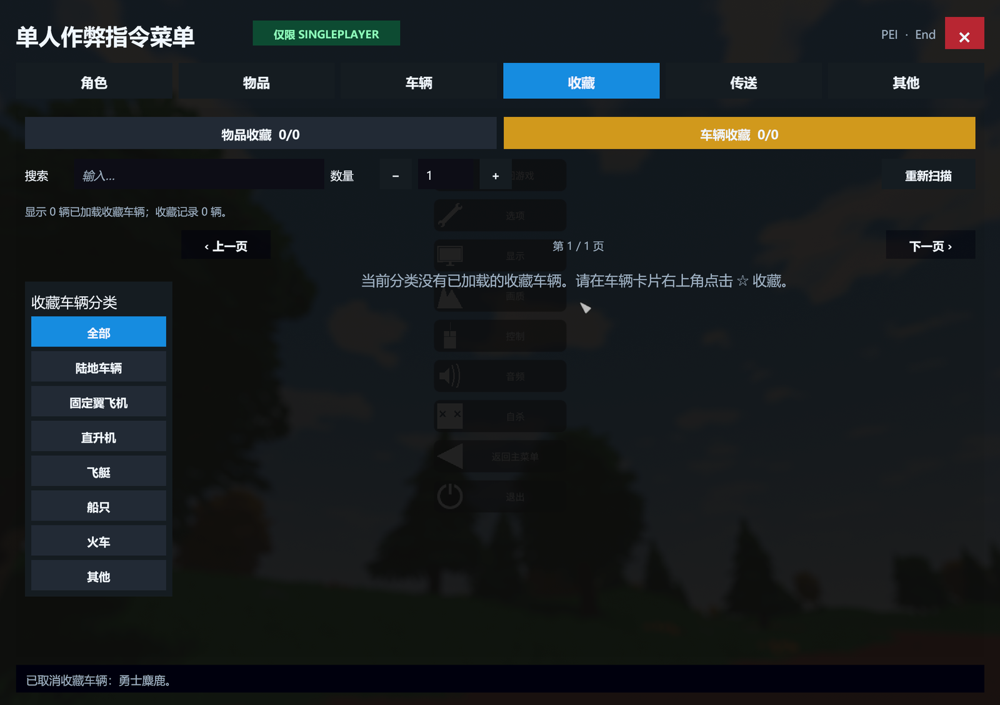
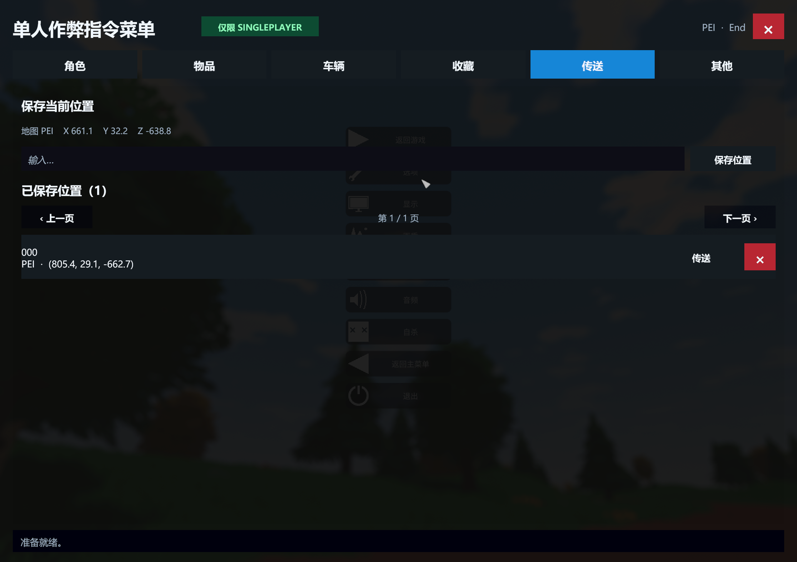
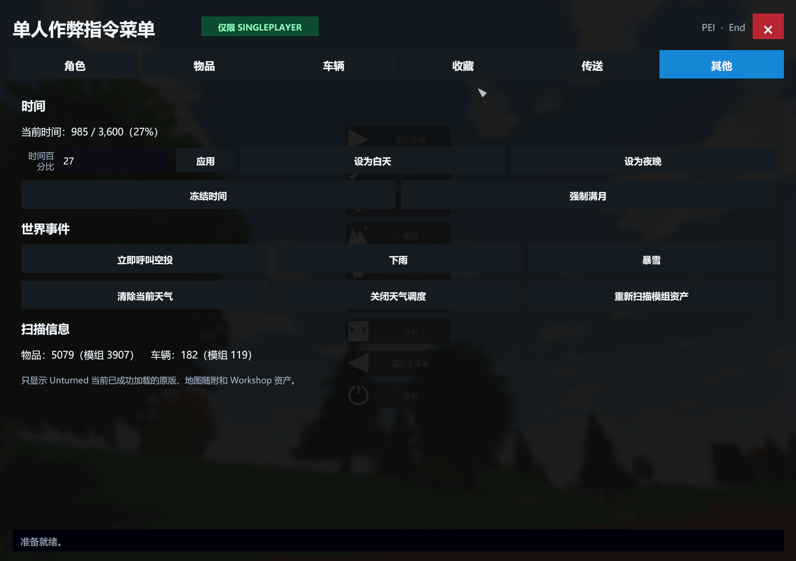

# Unturned Singleplayer Cheat Menu

[中文说明](README.md) · [Changelog](CHANGELOG.md) · [Acceptance matrix](ACCEPTANCE.md) · [Security](SECURITY.md)

A BepInEx 5 in-game menu built specifically for **Unturned singleplayer worlds**. It scans the asset registry already loaded by the running game, so vanilla, map-provided, and Workshop items and vehicles can appear automatically.

> **Singleplayer without BattlEye only.** This project does not disable, modify, or bypass BattlEye and does not support multiplayer servers.



<details>
<summary><strong>View more interface screenshots</strong></summary>

### Player stats and skills



### Vehicle browser and spawning



### Favorites



### Teleport points



### Time, weather, and world events



</details>

## Features

- Player controls: god mode, infinite survival stats, healing, configurable health/food/water/immunity/stamina/oxygen, experience, reputation, and max skills.
- Items: automatic loaded-asset scan, categories, name/ID/GUID/source search, pagination, game-generated icons, and quantities from `1–255`.
- Vehicles: automatic loaded-asset scan, engine categories, search, pagination, official or model-rendered thumbnails, and batches from `1–20` placed in front of the player.
- Favorites: persistent item and vehicle favorites keyed by asset GUID, with direct actions from the favorites tab.
- Teleports: multiple named, map-scoped, persistent positions with one-click teleport and delete controls.
- World controls: time slider, day/night, time freeze, full moon, airdrop, rain, snow, weather clearing, and asset rescan.

The menu only opens after confirming a loaded local player in a true `Singleplayer_` world where the current process is both client and server. It closes automatically if that condition stops being true.

The map setup checkbox named **singleplayer cheats** is not required. It controls Unturned's built-in command system; this plugin does not depend on `Provider.hasCheats`.

## Tested environment

| Component | Version |
| --- | --- |
| Unturned | `3.26.3.8` |
| Unity | `2022.3.62f3` |
| Runtime | Windows x64 / Unity Mono |
| BepInEx | `5.4.23.5` x64 |
| Plugin | `1.1.0` |

## Installation

The `Unturned-Singleplayer-Cheat-Menu-v1.1.0-Plugin-Only.zip` release asset contains the plugin only.

1. Exit Unturned.
2. Install BepInEx `5.4.23.5` x64 into the Unturned game root.
3. Extract the release asset into the directory containing `Unturned.exe`.
4. Verify that the DLL is located at:

   ```text
   BepInEx\plugins\UnturnedSingleplayerCheatMenu\UnturnedSingleplayerCheatMenu.dll
   ```

5. Use Steam's launch-option dialog and explicitly choose the **no BattlEye** entry.
6. Enter a singleplayer world and press `End` after the player has loaded.

Do not use this plugin with BattlEye or on multiplayer servers.

## Configuration and saved data

Files are created under `BepInEx/config` after first use:

- `com.codex.unturned.singleplayer-cheat-menu.cfg`
- `UnturnedSingleplayerCheatMenu.favorites.json`
- `UnturnedSingleplayerCheatMenu.teleports.json`

The default shortcut is `End` and can be changed through `ToggleShortcut`.

Only assets successfully loaded by the current game process are discoverable. Missing subscriptions, failed downloads, unresolved dependencies, or map-specific assets that were not loaded cannot be synthesized by the plugin.

## Building

Game, Unity, and BepInEx assemblies are intentionally not committed.

```powershell
.\scripts\Prepare-References.ps1 -GameRoot 'C:\Program Files (x86)\Steam\steamapps\common\Unturned'
dotnet build .\UnturnedSingleplayerCheatMenu.slnx -c Release
dotnet run --project .\tests\FavoritesSerializationSmoke\FavoritesSerializationSmoke.csproj -c Release
dotnet run --project .\tests\TeleportSerializationSmoke\TeleportSerializationSmoke.csproj -c Release
```

The helper copies required references into the git-ignored `lib/` directory. The plugin is emitted to `artifacts/UnturnedSingleplayerCheatMenu.dll`.

## Verification

Version 1.1.0 built with zero warnings and zero errors. Serialization smoke tests passed, and the menu, input isolation, loaded Workshop asset discovery, item giving, vehicle spawning, favorites persistence, teleports, time, weather, full moon, and airdrop actions were exercised in a real singleplayer world. See [ACCEPTANCE.md](ACCEPTANCE.md).

Published plugin DLL:

```text
SHA-256: CDFA683D3E963B8193FDD8D4CA8B7850CD2F22308D96DDCEA204C5C21AA86A87
```

## Disclaimer and license

This is an unofficial community project and is not affiliated with or endorsed by Smartly Dressed Games, Unturned, BattlEye, or BepInEx.

Plugin source code is available under the [MIT License](LICENSE). Unturned, Unity, BepInEx, and any third-party files retain their respective licenses and ownership.
